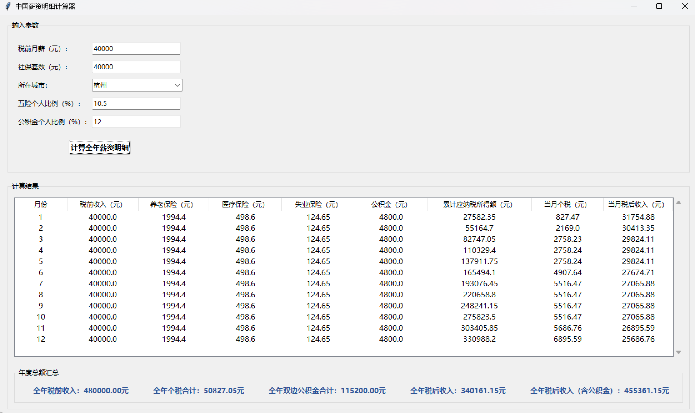

# 个税计算器 TaxCalculator
**个税计算器，适用中国大陆。**

**开发动机与目标：**

- 动机：网络现存个税计算器质量参差不齐（难以按照各城市灵活计算、仅支持单月税收计算、无法展示明细）。
- 目标：解决上述痛点，快捷方便计算个税，代码可扩展到全国多个城市，支持自定义。

**功能介绍：**

- 输入输出：
    - 输入：月薪、社保基数
    - 输出：每月明细（税前收入、五险一金详细值、税额、税后到手薪资）、年度累计值（税前总包、公积金、税后现金、税后含公积金总包）
- 计算逻辑：
    - 阶梯制所得税扣除
    - 五险一金（考虑各城市上限值，上限值来源网络，请以2025年各城市人社局公告为准）
- GUI与可视化：
    - 通过tkinter实现GUI
- 支持城市
    - 北京、杭州
    - 后续支持更多城市

**效果演示：**

**如何使用:**
`python tax_calc_gui.py`

**后续开发计划：**
- 支持年终奖单独计算
- 新增更多城市

**免责声明：**
这只是博主花费30分钟借助GPT完成的项目，博主只检查了核心逻辑、添加必要注释，与真实场景可能存在出入，请以个人实际为准。
博主仅通过网络其他个税计算器交叉验证，确认计算结果误差在100以内（具体值可能因各地政策差异不同）。